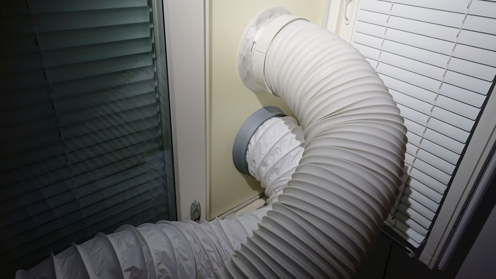
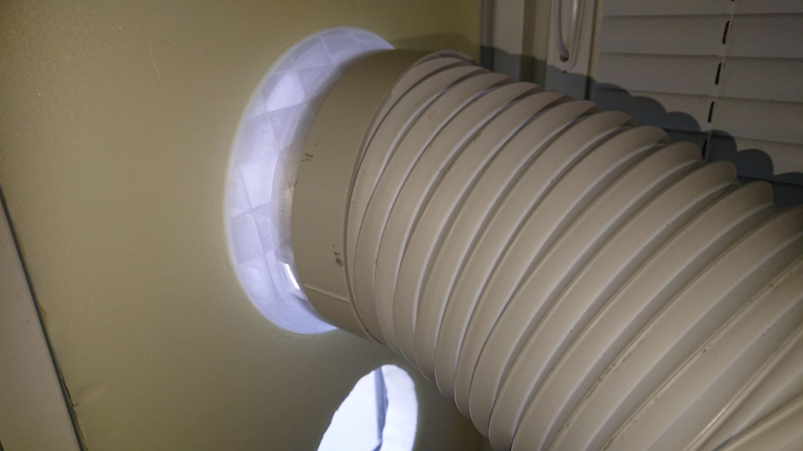
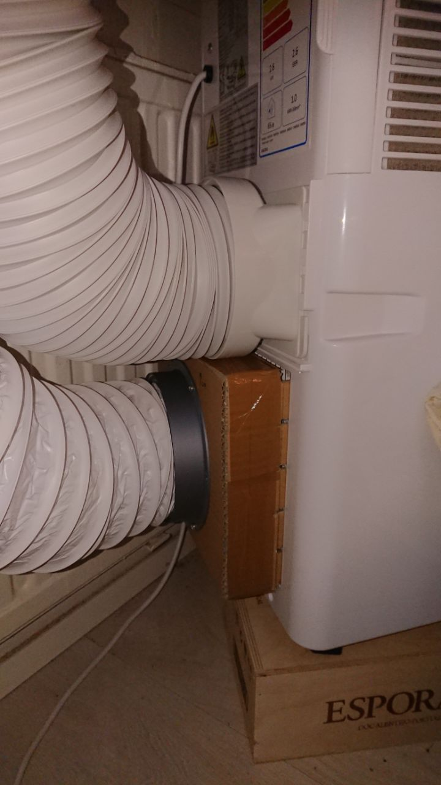
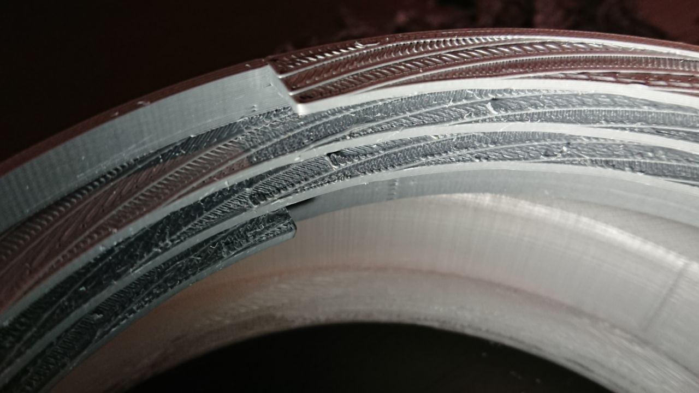
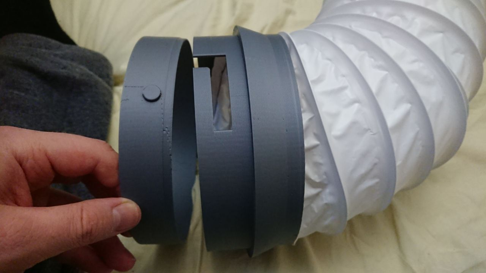

my air conditioning adapters
============================

You probably won't need any of these highly specific 3D print designs.

Procedure
---------

0. Suffer from 27+ °C indoors
1. Overthink those poor portable AC units
2. Buy one that seems decent from the internets
3. The delivery service destroys it
4. All decent ones are sold out because it's spring already
5. Get angry, lose interest
6. Buy a cheapo model from the nearest hardware store
7. Overthink a window attachment for its hose(s), buy some XPS sheet for a tight window fit
8. Hack up an intake hose connection out of cardboard and hose stuff from a hardware store
9. 3D print neat attachments for the hose ends for easier use
10. Document it so I'll remember later what has happened

TODO
~~~~

* Optimize: find where air is leaking, insulate the hoses, etc.
* Finish the outdoor parts to keep rain out.
* Hack up something on the cool air vent to shoot the air at an adjustable angle so the machine could be placed more conveniently in a corner.
* Buy a house or something to avoid this workaround shit in the first place.

exhaust_adapter.scad
--------------------

Adapts the exhaust hose end to the window panel.
The exhaust hose has proper plastic attachments on obviously the machine end and also on the window end, although the box didn't include any information on how to use that.

I've fitted a mosquito net separately on the whole window, so this piece doesn't have any filter things for when the device is off and no air is moving.
The inner pipe is supposed to be glued to a flap mechanism that doesn't exist yet to protect from heavy rain.
I'll get to that later.

input_screw_flange.scad
-----------------------

Adapts the DIY input hose to the the box thing that's around the large rectangular intake of the hot side.
The intake grille is way too big for 3d printing but easy-shaped so that just a cardboard adapter to another adapter is good enough.
The hose screws inside this printed part that is then attached on the cardboard box.

Fortunately the device appears to have separate air circuits for the hot side and the cold side, so it's possible to add an input hose to match the hot output.
This way the device at least won't unbalance the indoor air pressure and airflow so much and won't heat and push out the cooled indoor air.
I haven't measured whether this makes a big difference.

input_hose_collar.scad
----------------------

Like the side on the machine input, this screws on the `biltema hose`_ but on the other end that goes on the window panel like the exhaust adapter.
This is not an extra adapter but goes directly on the window panel.
The inner part is again supposed to be glued to a flap mechanism or something, see the exhaust_adapter story.

.. _biltema hose: https://www.biltema.fi/rakentaminen/lvi/ilmanvaihto/ilmanvaihtoletkut/ilmanvaihtoletku-2000031439

The device
----------

Bought from here: https://www.motonet.fi/fi/tuote/789629/Ilmastointilaite-siirrettava-9000-BTU

It's apparently Chinanordica A007G-09C: http://chinanordica.com/portableairconditioner_215.html

Kinda works but it's terrible.

License
-------

`CC-BY-SA 4.0 <https://creativecommons.org/licenses/by-sa/4.0/>`_ - tl;dr: share and adapt, just say where it's from and what you changed, and keep these conditions.
